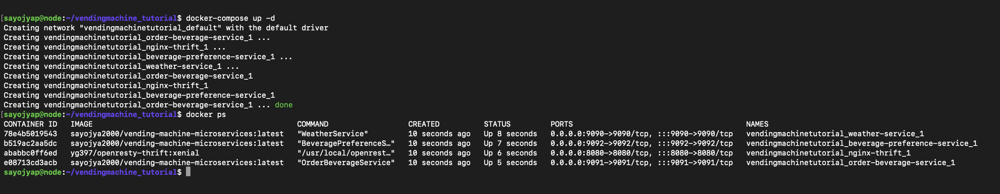

# ☕️ Vending Machine Microservices

This project simulates a smart vending machine using a distributed microservices architecture. Each service is containerized with Docker and communicates via Apache Thrift. The system selects a beverage based on the weather, which is determined using a city ID logic. It was originally developed as part of an Advanced Operating Systems course and refactored into a clean, deployable portfolio project.

---

## 📦 Tech Stack

- **C++** – Service logic implementation
- **Apache Thrift** – Cross-language RPC framework
- **Docker & Docker Compose** – Containerization and orchestration
- **NGINX** – Reverse proxy to route client requests

---

## 🧩 Microservices Overview

1. **Weather Service**
   - Determines weather type based on city ID.
   - Odd city ID → `WARM`, Even city ID → `COLD`

2. **Beverage Preference Service**
   - Returns a beverage name based on weather:
     - `Hot` → `cappuccino`, `latte`, `espresso`
     - `Cold` → `lemonade`, `ice tea`, `soda`

3. **Order Beverage Service**
   - Calls `WeatherService` → gets weather
   - Uses `BeveragePreferenceService` to fetch appropriate drink
   - Sends response to NGINX

4. **NGINX Proxy**
   - Receives client requests and forwards them to the Order Beverage Service.

---

## 🚀 Getting Started

### 1. Clone the Repository
```bash
git clone [https://github.com/YourUsername/vending-machine-microservices](https://github.com/neeraj3071/vending-system-docker-thrift).git
cd vending-machine-microservices
```

### 2. Build and Run All Services
```bash
docker-compose build
docker-compose up -d
```

### 3. Generate Requests
```bash
cd script
bash generate_request.sh > output.txt
```

### 4. Check Running Containers
```bash
docker ps -a
```

---

## 🗂️ Repository Structure

```
.
├── beverage-preference-service/
├── weather-service/
├── order-beverage-service/
├── nginx-thrift/
├── thrift/
│   └── vending_machine.thrift
├── script/
│   └── generate_request.sh
├── output.txt
├── docker-services.png
├── Advanced_OS_Assignment_Report_with_Screenshot.docx
├── docker-compose.yml
└── README.md
```

---

## 📸 Screenshot

All services up and running via `docker ps -a`:



---

## 📄 Deliverables

- [`output.txt`](./output.txt): Script output showing selected beverages.
- [`docker-services.png`](./docker-services.png): Screenshot of running containers.
- [`Advanced_OS_Assignment_Report_with_Screenshot.docx`](./Advanced_OS_Assignment_Report_with_Screenshot.docx): Final report.
- [Docker Hub Image](https://hub.docker.com/r/sayojya2000/vending-machine-microservices)

---

## 🤔 What We Learned

This project helped us understand the full lifecycle of distributed microservice systems. We gained experience with:
- Apache Thrift and service interface definition
- Containerizing multiple services and orchestrating them with Docker Compose
- Managing inter-service RPC communication
- Debugging containerized applications and updating build configurations

The project simulated a real-world microservices deployment pipeline and enhanced our understanding of backend service interactions and system-level programming.

---

## 👨‍💻 Authors

- [Neeraj Saini](https://github.com/neeraj3071)

